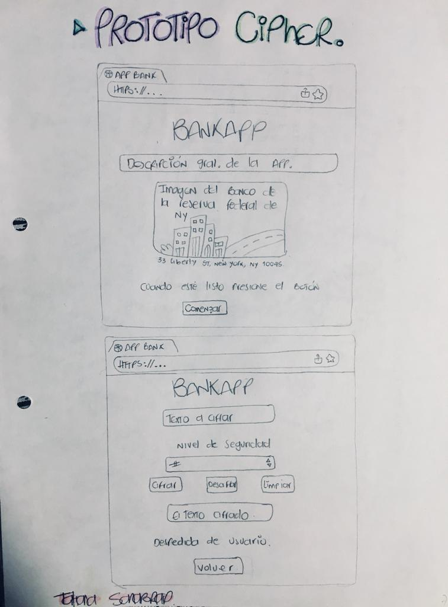
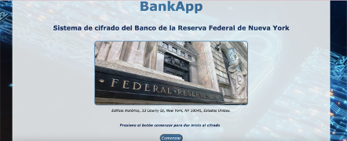
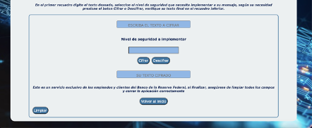

# CAESAR CIPHER

## PROTOTIPO A LÁPIZ

## INFORMACIÓN INICIAL

### Proceso
En un inicio el proceso de creación de *BankApp* estafa enfocado en el cifrado y descifrado de 1 sola palabra por cuadro de texto, por tal motivo, era una app algo limitada que en el diario vivir no sería funcional, así bien, a raiz de los diferentes feedbacks de mis compañeras y Coaches, vi la necesidad de crear una app que permitiera esta funcionalidad con textos más grandes segun el usuario lo requiera, así bien, a medida del paso del tiempo fui implementando diversos cambios en tamaño, colores y dispocisión de mi app, todo esto, teniendo como centro el usuario y la funcionaildad que quiero sea del 100% para ella(el).

### Diseño
*BankApp* busca mediante su diseño, transmitir la elegancia y sobriedad de la imagen que maneja el Banco de la Reserva Federal de Nueva York que es la base que tomé como referencia para crear mi app, así bien, la primera pantalla invita al usuario a conocer la fachada principal de la reserva y posteriormente a iniciar la interacción con la app mediante un botón que permite comenzar el proceso, posteriormente, la segunda pantalla es la interfaz central, la cual permite mediante cuadros de texto amigables ingresar el texto deseado y posteriormente seleccionar el nivel de seguridad del cifrado (desplazamiento), por último, el resultado se verá reflejado en el recuadro final de la farte inferior de la pantalla, el diseño de BankApp está pensado e implementado para que el usuario por medio de un botón pueda limpiar el texto inicial y comenzar de nuevo o volver a la página inicial, todo esto buscando la funcionalidad y optimización de los procesos.

## DEFINICIÓN DEL PRODUCTO

### Principales usuarios del producto
Los principales usuarios de BankApp son los empleados bancarios y clientes del Banco de la Reserva Federal de Nueva York.

### Objetivos del usuario
Los objetivos del usuario frente a *BankApp* es poder optimizar procesos en su día a día laboral, procesos que antes de BankApp debían hacerse de manera manual.

### Solución a problemas y necesidades
La seguridad bancaria es un tema que preocupa a los bancos alrededor del mundo, temas como la usurpación de identidad, el robo de datos y claves bancarias o el simple hecho de las compras fraudulentas por internet son el diario vivir de usuarios y compañías bancarias que se ven afectadas por este problema, así bien, en la era actual donde el 80% de las solicitudes son de manera Online, el sector bancario no es la excepción, solicitudes de tarjeta de crédito o diversos productos a distancia requieren de una asignación de datos inicial, por tal motivo, nace *BankApp*, aplicación que permite el cifrado de textos de la simensión que se requiera y posteriormente el descifrado del mismo, es un sistema bastante seguro ya que a la app solo tendrá acceso el empleado bancario y el usuario (por única vez mientras recibe el producto en su domicilio y procede con la debida activación), así mismo, contando con un nivel de seguridad que solo conocerán ambas partes. 

## APLICACIÓN DEFINITIVA

